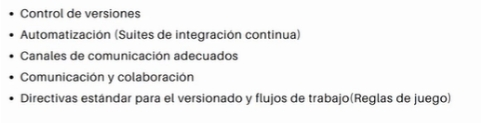
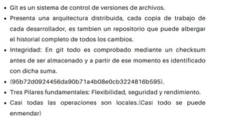
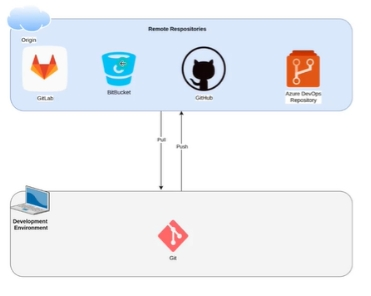
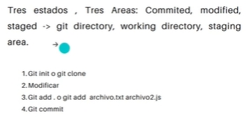
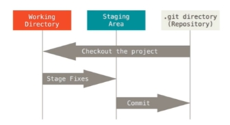
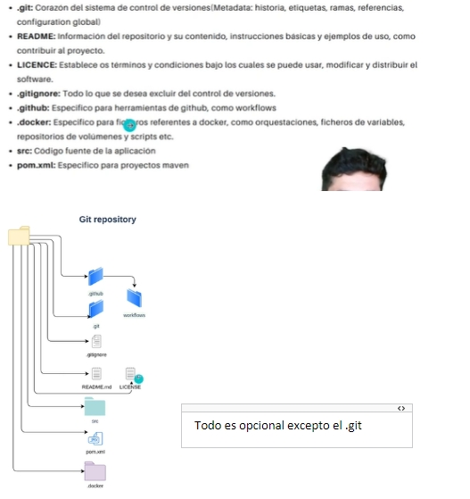

# Bases fundamentales 

**Integración continua**: relacionado con el código, más cerca de la parte dev. Poder conseguir que todos los programadores puedan integrar su código de una forma continua 

**Entrega continua**: más cerca de Ops. Despliegue continuo. Es una etapa posterior a la integración. 

 

## Integración continua  

 

 

## Aspectos claves 

 

## Herramientas  

Vamos a utilizar Github Actions, pero hay otras herramientas. 

 
 

 

Ofrece 4 componentes (además del entorno de desarrollo): 

- Repositorio de código 
- Repositorio de imágenes 
- Servidor de integración continua 
- Canal eficiente de comunicación  

 

El flujo de trabajo:  

1. Si nos incorporamos en un proyecto con diferentes repositorios habría que descargar el repositorio para empezar a trabajar o crearlos si no existen.  
2. Hacer uso del canal de comunicación  
3. Se disparan eventos donde habrá tareas automatizadas como tests y validaciones para que se publique en el repositorio 
4. Una vez se ha terminado se crea una imagen de docker en un repositorio 

## Git no es Github 

Git: linea de vida de los archivos a controlar, en la que nos podemos mover hacia delante y hacia atrás en las versiones 

Integridad: se genera un numero único en cada cambio para garantizar la integridad del repositorio (checksun) 

## Base de datos de Git 

Cualquier modificación en cualquier archivo guarda un histórico de todos los archivos del repositorio. Es más fácil para moverse en la línea de vida del proyecto. 

 

## Ciclo de vida de un archivo 

Un archivo puede tener tres estados: 

- Confirmado: estado inicial 

- Modificado: se modifica 

- Preparado: se agrega al repositorio sin hacer commit (git add) 

 

Cuando nos descargarnos un repositorio y lo clonamos se crea un dichero .git donde se reconoce como repositorio con el historial.  

En el repositorio de git está todo confirmado 

Cuando se quiere añadir el cambio se hace git add y se pasa al área de Staging (preparación) y cuando se hace commit se mueve al repositorio de git . 

 

HEAD: versión en determinado momento, normalmente en la que estas ubicado.  

 

## Repositorio de Git y estructura mínima recomendada 

 

