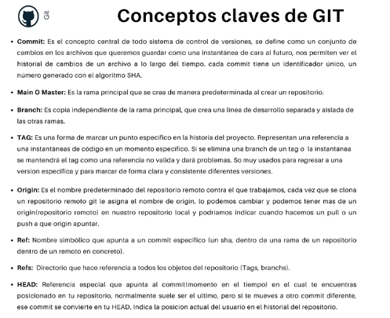
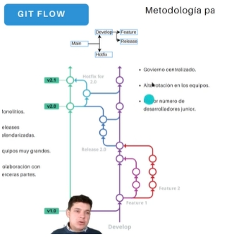
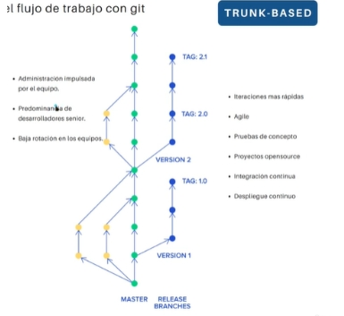
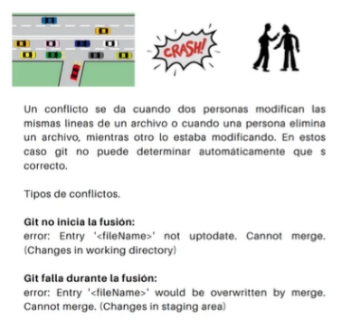
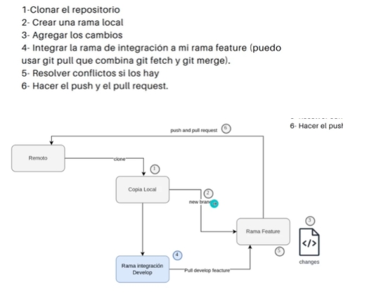

# Metodología y buenas prácticas 



Cada commit es una nueva versión, que es una foto de todo lo que tiene el repositorio en ese momento. Tiene un número SHA. 

- TAG: marcar un momento en la historia de vida del repositorio, con el fin de que sea más fácil reconocer la versión si en algún momento queremos volver a ella. Se marca un hito importante en el tiempo con la etiqueta. 

- Origin: identificación del repositorio remoto. Se pueden tener múltiples origins. 

- Ref: nombre simbólico que apunta a un commit 

- Refs: directorio dentro del .git  

- HEAD: referencia especial de un commit que normalmente se refiere al commit en el que estamos ubicado. 

## Metodologías con Git 

Rama **ciclo de vida largo**: se mantiene durante todo el ciclo de vida del repositorio 

**Ciclo de vida corto**: cuando acaba la característico se integra en una de ciclo de vida largo y desaparece. 

**GIT FLOW**: rama main con la versión más estable del código, rama develop. Esas dos son de ciclo de vida largo. Rama feature y release que se integran en develop. Feature para una característica, cuando se hace la entrega se integra en develop. Releaseparecido. Holfix si hay algún problema y se agrega la solución. Sale de main y se integra a develop y main. Las tags determinan algo importante que haya sucedido. 
Para gobierno centralizado, alta rotación de equipos y mayor número de desarrolladores junior  



**TRUNK-BASED**: solo rama master de ciclo largo. Se derivan de ella características que se integra en la master. También se generan tags. Para Seniors 
 


## Buenas prácticas 
 
``` 
$ cat .git/HEAD para saber dónde estamos  

$ git branch muestra las ramas en local 

$ git branch -r  muestra las ramas en remoto tambien  

$ git pull origin develop para descargar esa rama 

$ git checkout develop para salir hacia esa rama y en git branch las muestra 

$ git checkout -b feature/0001-add-cancel-button crea rama y te mueve a ella 

$ git checkout - devuelve al ultimo commit que tenia  

$ git push -u origin feature/0001-add-cancel-button hace push de esa rama 

$ git fetch --all para descargar todas las ramas 

```
 

Al llegar lo que habría que hacer es: Descargar código, hacer pull de lo último, crear feature 


## Conflictos 


 
## Flujo de trabajo recomendado



Antes de hacer push se hace un pull de la develop. Te puedes cambiar a la rama develop y hacer un git pull origin para descargar todo de la rama actual. Asi puedes ver si la rama está actualizada o ha habido cambios. Ahora se hace git merge develop para integrar la develop con la actual (en local). Si hubiera conflictos los mostraría. Ahora se haría el push git push -u origin (de la feature). Ahora se hace una pr de la feature a la develop (cuando ya estas seguro que no hay conflictos). 

 

 
